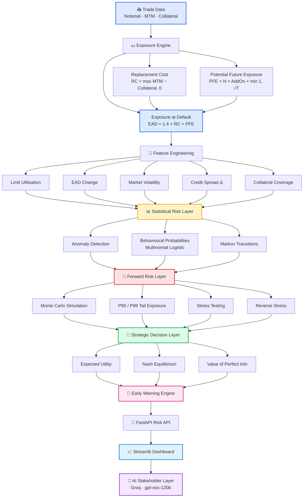
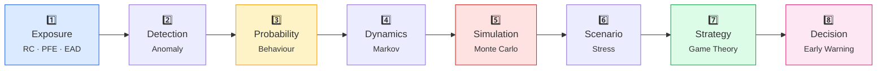
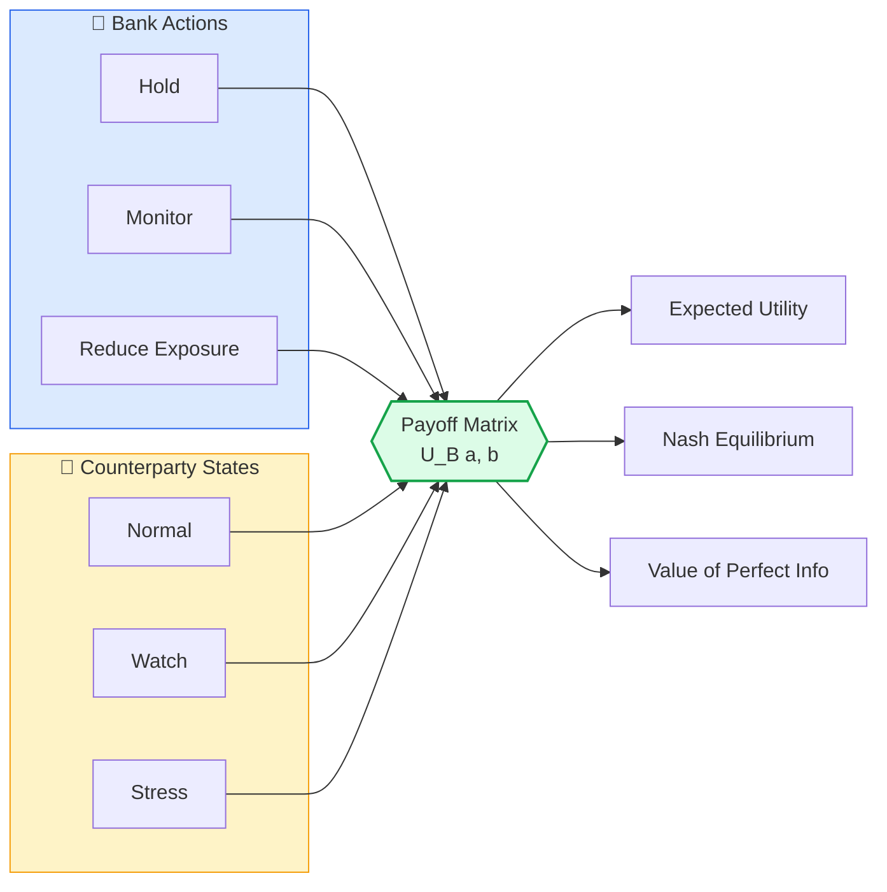
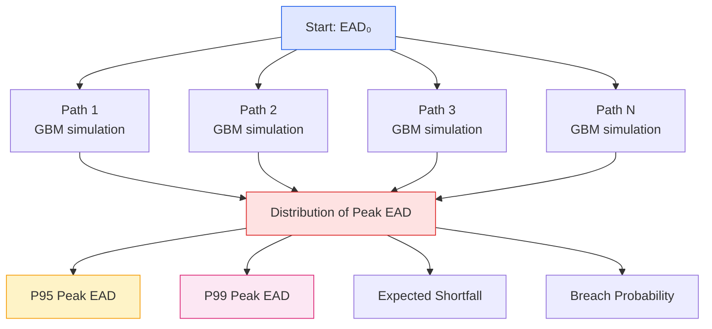
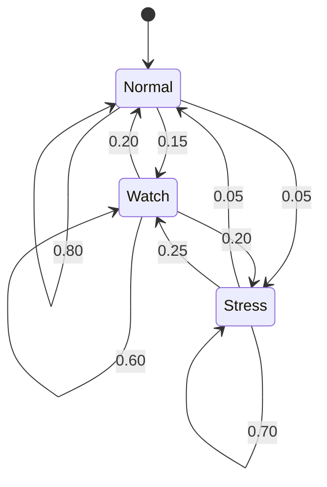
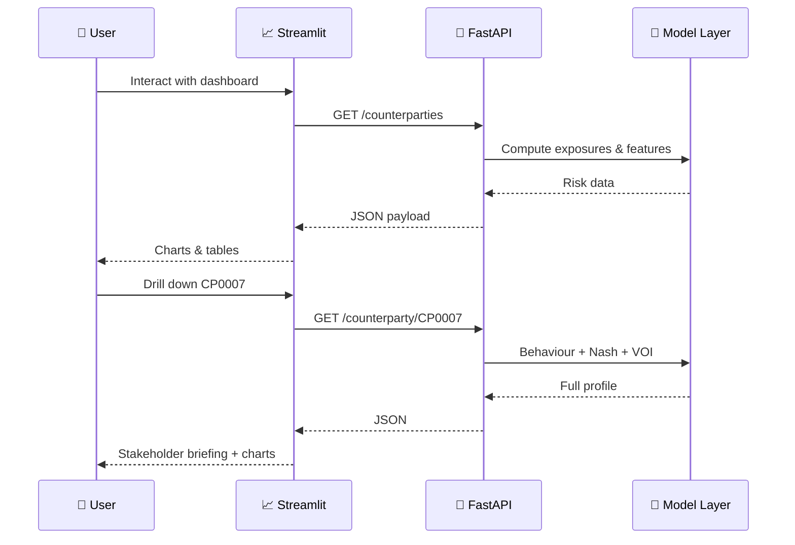
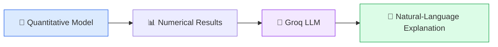
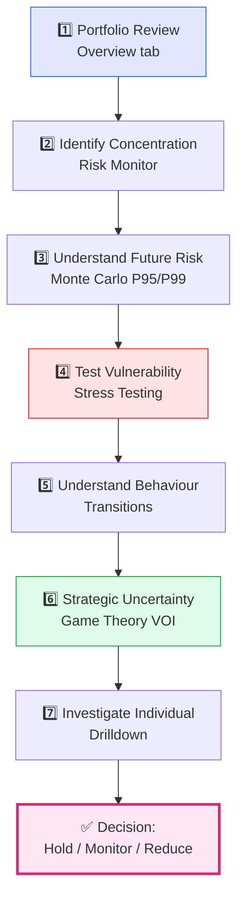

<div align="center">

# 📐 CCR Quant Risk

### Game-Theoretic Counterparty Credit Risk & Early-Warning Analytics Platform

**Exposure · Probability · Simulation · Strategy · Decision Support**

[](https://ccr-game-theory-risk-h5.streamlit.app//)
[](https://python.org)
[](https://streamlit.io)
[](https://fastapi.tiangolo.com)
[](https://docker.com)
[](LICENSE)

<br/>

> **How large is the exposure, how likely is it to deteriorate, how severe could the deterioration become, how might the counterparty behave, and how should uncertainty be incorporated into risk decisions?**

<br/>

**[🚀 Launch Live Dashboard](https://ccr-game-theory-risk-1.onrender.com/)** · **[📖 Read the Maths](#-mathematical-foundations)** · **[🏗 Architecture](#-system-architecture)** · **[⚠️ Limitations](#-model-limitations)**

</div>

---

## 📑 Table of Contents

<details open>
<summary><b>Click to expand / collapse</b></summary>

| Section | Description |
|---|---|
| [🎯 Executive Summary](#-executive-summary) | What the project is and why it exists |
| [💡 The Business Problem](#-the-business-problem) | Why current exposure alone is not enough |
| [🏗 System Architecture](#-system-architecture) | 8-layer analytics pipeline |
| [🧮 Mathematical Foundations](#-mathematical-foundations) | All core formulas explained |
| [📊 Dashboard Walkthrough](#-dashboard-walkthrough) | How to read each tab |
| [🎲 Game Theory Module](#-game-theory-module) | Nash, expected utility, VOI |
| [📈 Monte Carlo & Tail Risk](#-monte-carlo--tail-risk) | P95, P99 and peak EAD |
| [🌪️ Stress Testing](#️-stress-testing) | Named shocks & reverse stress |
| [🔀 Behavioural Modelling](#-behavioural-modelling) | Markov chains & stationary distribution |
| [🚨 Early Warning System](#-early-warning-system) | Composite risk scoring |
| [🛠 Tech Stack](#-technology-stack) | Frameworks & tooling |
| [🔌 API Reference](#-api-reference) | FastAPI endpoints |
| [🤖 AI Interpretation Layer](#-ai-interpretation-layer) | Groq-powered stakeholder briefings |
| [⚠️ Model Limitations](#-model-limitations) | What this is and isn't |
| [🎓 What This Demonstrates](#-what-this-project-demonstrates) | Skills showcased |
| [⚖️ Disclaimer](#️-disclaimer) | Regulatory notice |

</details>

---

## 🎯 Executive Summary

**Counterparty Credit Risk (CCR)** is the risk that a counterparty to a financial contract fails to meet its obligations before the contract settles.

Traditional monitoring focuses on **current exposure** — $EAD_t$ — but this leaves critical questions unanswered:

<table>
<tr>
<td width="50%" valign="top">

### ❌ What current exposure misses

- Is exposure **increasing**?
- Is the counterparty **approaching its limit**?
- What is the **probability of a future breach**?
- How **persistent** is the current behaviour?
- What happens under **adverse scenarios**?
- How large could exposure become **in the tail**?

</td>
<td width="50%" valign="top">

### ✅ What this platform answers

- **Forward-looking** breach probability (30d)
- **Behavioural** state probability via logistic model
- **Dynamic** state persistence via Markov chains
- **Stochastic** exposure distribution via Monte Carlo
- **Scenario** shocks via stress & reverse-stress
- **Strategic** decision via Nash equilibrium & VOI

</td>
</tr>
</table>

The project integrates **mathematics, statistics, machine learning, stochastic simulation, and game theory** into a single decision-support framework.

---

## 💡 The Business Problem

Two counterparties can share the same **current exposure** but have radically different **forward risk**:

| Counterparty | Current EAD | Limit Utilisation | 30-Day Breach Prob. | Interpretation |
|:---:|:---:|:---:|:---:|---|
| **A** | £5M | **45%** | **8%** | 🟢 Comfortable headroom |
| **B** | £5M | **85%** | **42%** | 🔴 Elevated forward risk |

> **Key insight:** $\text{Current Exposure} \neq \text{Future Risk}$

This platform bridges that gap by combining **current state** with **forward-looking probability, dynamics, and strategy**.

---

## 🏗 System Architecture

### End-to-End Analytics Pipeline



### The 8-Layer Design



---

## 🧮 Mathematical Foundations

### 1. Exposure Framework

The system uses a simplified **SA-CCR-inspired** exposure model:

$$
\boxed{EAD = \alpha \cdot (RC + PFE)}, \quad \alpha = 1.4
$$

<details>
<summary><b>📐 Replacement Cost (RC)</b></summary>

Current positive exposure of a trade:

$$
RC = \max(MTM - Collateral, 0) \quad \text{(margined)}
$$

$$
RC = \max(MTM, 0) \quad \text{(unmargined)}
$$

**Example:** $MTM = £2M$, $Collateral = £0.5M$

$$RC = \max(2 - 0.5, 0) = £1.5M$$

> The max-with-zero prevents negative MTM from producing positive current exposure.

</details>

<details>
<summary><b>📈 Potential Future Exposure (PFE)</b></summary>

Forward-looking exposure using notional and maturity:

$$
PFE = Notional \times AddOnFactor \times \min(1, \sqrt{T})
$$

**Example:** $Notional = £10M$, $AddOn = 5\%$, $T = 0.25$

$$PFE = 10 \times 0.05 \times \sqrt{0.25} = £0.25M$$

</details>

<details>
<summary><b>💷 Exposure at Default (EAD)</b></summary>

Combining RC and PFE:

$$EAD = 1.4 \times (1.5 + 0.25) = £2.45M$$

</details>

### 2. Limit Utilisation

$$
U = \frac{EAD}{Credit\ Limit}
$$

| Utilisation | Interpretation |
|:---:|---|
| Low (< 50%) | 🟢 Significant remaining headroom |
| Moderate (50–80%) | 🟡 Increasing use of capacity |
| High (80–100%) | 🟠 Limited remaining headroom |
| **Over 100%** | 🔴 **Exposure exceeds defined limit** |

### 3. Behavioural Probability (Multinomial Logistic)

$$
P(Y = k \mid X) = \frac{e^{\beta_k^T X}}{\sum_j e^{\beta_j^T X}}
$$

> **Interpretation:** If the model outputs `Stress = 0.45`, it means *"under these features and assumptions, Stress is the highest-probability behavioural state"* — **not** *"the counterparty will definitely become stressed."*

### 4. Markov Chain Transitions

$$
P(S_{t+1} \mid S_t, S_{t-1}, \ldots) \approx P(S_{t+1} \mid S_t)
$$

**Example transition matrix:**

$$
P = \begin{bmatrix}
0.80 & 0.15 & 0.05 \\
0.20 & 0.60 & 0.20 \\
0.05 & 0.25 & 0.70
\end{bmatrix}
$$

Rows = **today's** state, Columns = **tomorrow's** state.

$P(\text{Stress}_{t+1} \mid \text{Stress}_t) = 0.70$ → **70% probability of staying stressed**.

### 5. Stationary Distribution

$$
\pi P = \pi, \quad \sum_i \pi_i = 1
$$

Represents the long-run proportion of time in each state under current dynamics.

### 6. Monte Carlo Simulation

$$
X_{t + \Delta t} = X_t + \mu \Delta t + \sigma \sqrt{\Delta t} \cdot Z, \quad Z \sim N(0,1)
$$

Generates **N** exposure paths → distribution → tail quantiles.

### 7. Tail Risk — P95 / P99

| Metric | Meaning |
|---|---|
| **P95 Peak EAD** | 95% of simulated outcomes are at or below this value |
| **P99 Peak EAD** | 99% of simulated outcomes are at or below this value |

**Example:**

```text
Current EAD  = £10M
P95 Peak EAD = £14M   →  P(Peak > £14M) ≈ 5%
P99 Peak EAD = £18M   →  P(Peak > £18M) ≈ 1%
```

### 8. Expected Utility

$$
EU(a) = \sum_s P(s) \cdot U(a, s)
$$

For probabilities $P(N)=0.20$, $P(W)=0.35$, $P(S)=0.45$:

$$
EU(a) = 0.20 U(a,N) + 0.35 U(a,W) + 0.45 U(a,S)
$$

### 9. Nash Equilibrium

Neither player can improve payoff by unilateral deviation:

$$
U_B(a^*, b^*) \geq U_B(a, b^*) \quad \forall a
$$

$$
U_C(a^*, b^*) \geq U_C(a^*, b) \quad \forall b
$$

### 10. Value of Perfect Information (VOI)

$$
VOI = EU_{perfect} - EU_{current}
$$

where:

$$
EU_{perfect} = \sum_s P(s) \max_a U(a, s), \quad EU_{current} = \max_a \sum_s P(s) U(a, s)
$$

> **Business meaning:** VOI quantifies the **decision value of reducing uncertainty**. High VOI → additional information could materially change the recommendation.

### 11. Early Warning Score

$$
Score = w_1 A + w_2 U + w_3 T + w_4 S
$$

where $A$ = anomaly, $U$ = utilisation, $T$ = exposure trend, $S$ = spread signal.

---

## 📊 Dashboard Walkthrough

### Recommended Reading Flow

```mermaid
flowchart LR
    A[1️⃣ Overview<br/><small>Portfolio KPIs</small>] --> B[2️⃣ Risk Monitor<br/><small>Where is risk?</small>]
    B --> C[3️⃣ Game Theory<br/><small>How to decide?</small>]
    C --> D[4️⃣ Monte Carlo<br/><small>How large could it be?</small>]
    D --> E[5️⃣ Stress Testing<br/><small>What if...?</small>]
    E --> F[6️⃣ Transitions<br/><small>How sticky?</small>]
    F --> G[7️⃣ Drilldown<br/><small>Who exactly?</small>]

    style A fill:#e0e7ff,stroke:#2563eb
    style B fill:#fef3c7,stroke:#f59e0b
    style C fill:#dcfce7,stroke:#16a34a
    style D fill:#fee2e2,stroke:#dc2626
    style E fill:#fce7f3,stroke:#db2777
    style F fill:#e0f2fe,stroke:#0284c7
    style G fill:#f3e8ff,stroke:#9333ea
```



<details>
<summary><b>📌 Overview Tab</b> — Portfolio-level KPIs</summary>

| Metric | Meaning |
|---|---|
| **Total EAD** | Aggregate exposure across all counterparties |
| **Counterparties** | Number of entities in the book |
| **Anomalies** | Statistically unusual observations |
| **Trades** | Total trade population |
| **Mean Utilisation** | Average $EAD / Limit$ across the book |

**Portfolio takeaway** panel provides an executive summary via `interpret_overview()`.

</details>

<details>
<summary><b>📌 Risk Monitor Tab</b> — Where is risk concentrated?</summary>

**Key visualisation:** *Risk Matrix* — utilisation (X) vs 30-day breach probability (Y), bubble size = EAD, colour = warning band.

**Look for:**
- 🔴 Top-right quadrant (**ESCALATE zone**) — high utilisation + high breach probability
- 🟠 Names above the median-probability line
- 🟡 Bubbles crossing the 80% utilisation reference line

**Table:** interactive portfolio grid with progress bars for utilisation, colour-coded bands, and CSV export.

</details>

<details>
<summary><b>📌 Game Theory Tab</b> — How does uncertainty affect the decision?</summary>

**Interpretation sequence:**

```text
What does the model think the counterparty may do?
                ↓
What does that imply for each bank action?
                ↓
What is the equilibrium?
                ↓
How sensitive is the decision to uncertainty?
```

**Charts:**
- 🍩 Donut — preferred pure strategy distribution
- 📊 Histogram — Value of Perfect Information across the book
- 🎯 Scatter — VOI vs breach probability (top-right = investigate first)

</details>

<details>
<summary><b>📌 Monte Carlo Tab</b> — How large could exposure become?</summary>

**Focus on:** breach probability distribution, P95/P99 peak EAD scatter, top-10 tail contributors.

**Core idea:** $\text{Tail Exposure} > \text{Typical Exposure}$

</details>

<details>
<summary><b>📌 Stress Testing Tab</b> — What if adverse conditions occur?</summary>

**Compare:**
$$\Delta EAD = EAD_{stress} - EAD_{base}$$

**Also examine:** $N_{over\ limit}$ — how many counterparties breach limits under each shock.

</details>

<details>
<summary><b>📌 Behaviour Transitions Tab</b> — How persistent are risk states?</summary>

**Heatmap:** rows = yesterday, columns = today. Strong diagonal = sticky states.

**Stationary mix:** long-run distribution via $\pi P = \pi$.

</details>

<details>
<summary><b>📌 Drilldown Tab</b> — Individual counterparty profile</summary>

Full mathematical risk profile:

```text
Current EAD → Utilisation → Breach Prob → Behaviour Prob
     → Early Warning Drivers → Expected Utilities → Nash → VOI
```

Includes a **limit-utilisation gauge**, **behaviour-probability bar**, **expected-utility grouped bar**, **mixed-Nash donut**, and **early-warning driver waterfall**.

</details>

---

## 🎲 Game Theory Module

Counterparty risk is **not purely mechanical** — it's a strategic interaction.



### Mixed-Strategy Nash

Sometimes the equilibrium is **probabilistic**:

```text
Monitor  → 50%
Hold     → 20%
Reduce   → 30%
```

> **Important:** This is the *mathematical* equilibrium mix, not a directive to randomise actions.

---

## 📈 Monte Carlo & Tail Risk



**Why tail risk matters:** Average exposure can hide extreme outcomes. A portfolio that looks comfortable on average may have **materially less headroom in the tail**.

---

## 🌪️ Stress Testing

| Scenario | Shock Applied | Purpose |
|---|---|---|
| 📈 **Rates Up** | Parallel yield shift | Interest-rate sensitivity |
| 💱 **FX Shock** | Currency revaluation | FX exposure |
| 📉 **Equity Selloff** | Equity index drop | Equity-linked trades |
| ⚠️ **Credit Widening** | Spread expansion | Counterparty credit deterioration |
| 🔥 **Combined Stress** | Multi-factor | Systemic scenario |

### Reverse Stress Testing

Instead of *"what happens if we shock by X?"*:

> **"How large a shock would push the portfolio to a defined failure threshold?"**

Find $x$ such that:

$$
Risk(x) \geq Threshold
$$

**Example output:** *"A 12% uniform shock pushes ~25% of the book over limit."*

> ⚠️ This is **not** a probability that the shock will occur — it's a **capacity / resilience** measure.

---

## 🔀 Behavioural Modelling



**Interpretation:**
- **High diagonal** → states are **sticky** (deterioration is persistent)
- **High off-diagonal into Stress** → rising risk of transition
- **Stationary distribution** → long-run composition of the book

---

## 🚨 Early Warning System

Composite score combining four signals:

| Weight | Signal | Meaning |
|:---:|---|---|
| $w_1$ | **Anomaly** | Statistical deviation from learned patterns |
| $w_2$ | **Utilisation** | How close to credit limit |
| $w_3$ | **Trend** | Direction of EAD change |
| $w_4$ | **Spread** | Credit spread movement |

Maps into **Low / Moderate / High** bands for prioritisation.

> A high warning score means **the combination of observed signals is elevated under the model** — not that default is certain.

---

## 🛠 Technology Stack

<table>
<tr>
<td valign="top" width="25%">

**🧮 Modelling**
- Python 3.10+
- NumPy
- Pandas
- SciPy
- Scikit-learn

</td>
<td valign="top" width="25%">

**🔌 Backend**
- FastAPI
- Uvicorn
- Pydantic
- REST API

</td>
<td valign="top" width="25%">

**📊 Frontend**
- Streamlit
- Plotly
- Custom CSS

</td>
<td valign="top" width="25%">

**🚀 Ops**
- Docker
- Render
- Pytest
- GitHub Actions

</td>
</tr>
</table>

**🤖 AI Layer:** Groq API · `openai/gpt-oss-120b` for stakeholder briefings

---

## 🔌 API Reference

| Endpoint | Method | Purpose |
|---|:---:|---|
| `/health` | `GET` | Service health check |
| `/metrics` | `GET` | Portfolio-level KPIs |
| `/counterparties` | `GET` | Full counterparty book with risk features |
| `/counterparty/{id}` | `GET` | Deep-dive for a single counterparty |
| `/transitions` | `GET` | Markov transition matrix |
| `/stress` | `GET` | Stress & reverse-stress results |



---

## 🤖 AI Interpretation Layer

**Separation of concerns:**



The LLM **does not** replace or recompute the mathematics. It translates supplied numbers into:

1. **Finding** — what the model actually produced
2. **Meaning** — what it means mathematically
3. **Risk implication** — why it matters
4. **Management consideration** — what to investigate
5. **Limitation** — what assumptions constrain interpretation

> *Set `GROQ_API_KEY` in `.env` to enable live briefings. Without it, deterministic text from the same model outputs is shown.*

---

## ⚠️ Model Limitations

<table>
<tr><td>

### 🧮 Simplified CCR Formula
Not a production SA-CCR implementation. Educational and simplified.

### 📁 Synthetic Data
Demonstrates architecture & methodology — not calibrated to real portfolios.

### 🎲 Behavioural Model
Depends on features and model assumptions; recalibrate per institution.

### 🔀 Markov Assumption
Assumes state dynamics are captured by the estimated transition matrix.

</td><td>

### 📈 Monte Carlo
Results depend on distributions, correlations, volatility, horizon, and scenario design.

### 🎲 Game Theory
$Nash = f(\text{Payoffs}, \text{Probabilities}, \text{Strategies})$

Changing payoffs changes the equilibrium.

### 📊 VOI
Depends on the utility model and assumed states.

### 🤖 AI Layer
Explains supplied outputs — does not validate the mathematics.

</td></tr>
</table>

---

## 🎓 What This Project Demonstrates

<table>
<tr>
<td valign="top" width="33%">

### 🔬 Quantitative
- Probability theory
- Stochastic processes
- Markov chains
- Monte Carlo methods
- Expected utility & game theory
- Optimisation

</td>
<td valign="top" width="33%">

### 📊 Data Science
- Anomaly detection
- Probabilistic modelling
- Feature engineering
- Tail-risk analysis
- Classification
- Model interpretation

</td>
<td valign="top" width="33%">

### 🚀 Engineering
- Python · FastAPI · Streamlit
- Docker · Render deployment
- REST API design
- Automated testing
- Production caching
- Layered architecture

</td>
</tr>
<tr>
<td valign="top" width="33%">

### 💼 Business
- Credit-limit monitoring
- Early-warning detection
- Portfolio concentration
- Scenario analysis
- Decision support

</td>
<td valign="top" width="33%">

### 📣 Communication
- Stakeholder briefings
- Plain-language interpretation
- "Finding → Implication → Action"
- Executive summaries

</td>
<td valign="top" width="33%">

### 🎯 Product Thinking
- Multi-layer UX
- Risk-appetite filters
- Interactive drilldowns
- Cross-tab consistency

</td>
</tr>
</table>

---

## 📁 Project Structure

```text
ccr-game-theory-risk/
├── app/
│   └── streamlit_app.py          # Dashboard entry point
├── src/
│   ├── ccr_engine.py             # RC · PFE · EAD calculation
│   ├── anomaly.py                # Statistical anomaly detection
│   ├── behaviour.py              # Multinomial logistic model
│   ├── markov.py                 # Transition & stationary distribution
│   ├── monte_carlo.py            # Simulation engine
│   ├── stress.py                 # Named + reverse stress testing
│   ├── game_theory.py            # Nash · EU · VOI
│   ├── early_warning.py          # Composite scoring
│   └── explainer.py              # Interpretation layer
├── api/
│   └── main.py                   # FastAPI application
├── data/
│   └── trades.csv                # Portfolio data
├── tests/
│   └── test_*.py                 # Pytest suite
├── Dockerfile
├── docker-compose.yml
├── requirements.txt
├── .env.example
└── README.md
```

---

## 🚀 Quick Start

### 1️⃣ Clone & install

```bash
git clone https://github.com/your-username/ccr-game-theory-risk.git
cd ccr-game-theory-risk
pip install -r requirements.txt
```

### 2️⃣ Configure environment

```bash
cp .env.example .env
# Edit .env:
#   BACKEND_URL=http://localhost:8000
#   GROQ_API_KEY=your_key_here  (optional)
```

### 3️⃣ Run the backend

```bash
uvicorn api.main:app --reload --port 8000
```

### 4️⃣ Run the dashboard

```bash
streamlit run app/streamlit_app.py
```

### 5️⃣ Or with Docker

```bash
docker-compose up --build
```

Open **http://localhost:8501**.

---

## 🔄 Risk Manager Workflow



---

## 📐 Mathematical Summary Card

$$
\begin{aligned}
&\text{Exposure:} &\quad RC &= \max(MTM - C, 0) \\
& &\quad PFE &= N \cdot A \cdot \min(1, \sqrt{T}) \\
& &\quad EAD &= 1.4(RC + PFE) \\[4pt]
&\text{Utilisation:} &\quad U &= \frac{EAD}{L} \\[4pt]
&\text{Behaviour:} &\quad P(Y=k|X) &= \frac{e^{\beta_k^T X}}{\sum_j e^{\beta_j^T X}} \\[4pt]
&\text{Markov:} &\quad P_{ij} &= P(S_{t+1}=j \mid S_t=i) \\[4pt]
&\text{Stationary:} &\quad \pi P &= \pi \\[4pt]
&\text{Monte Carlo:} &\quad X_{t+\Delta t} &= X_t + \mu \Delta t + \sigma\sqrt{\Delta t} Z \\[4pt]
&\text{Expected Utility:} &\quad EU(a) &= \sum_s P(s) U(a,s) \\[4pt]
&\text{VOI:} &\quad VOI &= EU_{perfect} - EU_{current} \\[4pt]
&\text{Early Warning:} &\quad Score &= w_1 A + w_2 U + w_3 T + w_4 S
\end{aligned}
$$

$$
\boxed{\text{Exposure} \rightarrow \text{Probability} \rightarrow \text{Dynamics} \rightarrow \text{Simulation} \rightarrow \text{Strategy} \rightarrow \text{Early Warning} \rightarrow \text{Decision}}
$$

---

## 🎯 Final Takeaway

This project does **not** simply ask:

> *"What is the current exposure?"*

It asks:

> **"What is the current exposure, how might it evolve, what could happen under uncertainty and stress, how does counterparty behaviour affect the decision, and where should risk management focus its attention?"**

$$
\boxed{
\text{Current Exposure} \to \text{Future Risk} \to \text{Tail Risk} \to \text{Stress Risk} \to \text{Strategic Uncertainty} \to \text{Decision Support}
}
$$

---

## ⚖️ Disclaimer

This application is an **educational and portfolio-oriented** quantitative risk analytics system.

It is **not** a substitute for:

- 🏛 Regulated CCR models
- 📋 Internal credit policies
- 💰 Regulatory capital calculations
- ⚖️ Legal documentation
- ✅ Credit approval processes
- 🔬 Validated institutional risk models
- 👔 Professional risk-management judgement

All model outputs should be interpreted within the assumptions, data, and parameterisation used by the system.

---

<div align="center">

### 🚀 Try the Live Dashboard

[](https://ccr-game-theory-risk-h5.streamlit.app//)

<br/>

**Built with** ❤️ **using Python · FastAPI · Streamlit · Plotly · Groq**

<br/>

⭐ **If you found this project interesting, please consider giving it a star!** ⭐

<br/>

<sub>© 2025 · CCR Quant Risk · Educational Quantitative Risk Analytics</sub>

</div>
